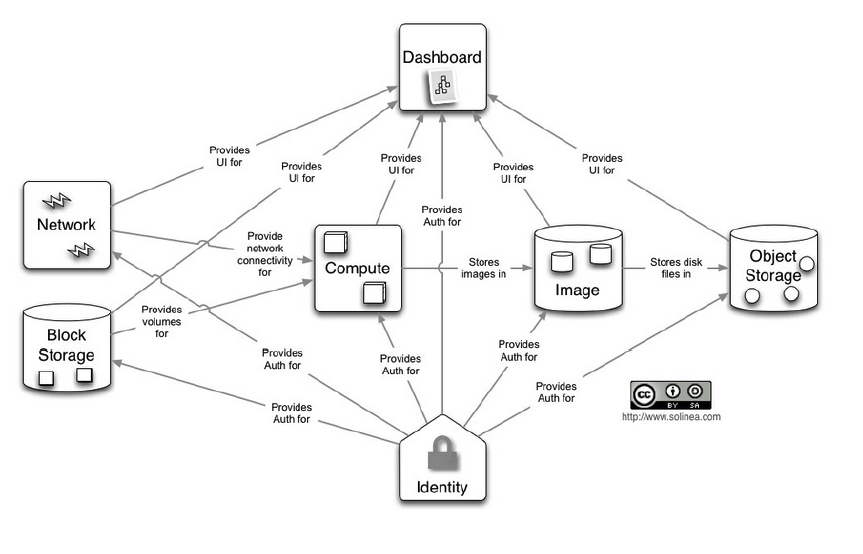

# ECE 592: High Performance Cloud Computing Services
## Project 1 - OpenStack IaaS Deployment

### 

The goal of the project was to learn how to deploy basic services of IaaS(Infrastructure as a Service) using the Openstack project, an open source cloud computing software, designed for automation.

### The services of Openstack are depicted below:



## Deployment Automation Using Ansible
### Requirement
- Linux Host(Either on Physical or Virtual).

### Before you begin
- Edit in file ansible/vars/main.yaml, the variable 'NETWORK_CIDR' to match to your physical network

### Procedure (CLI on Linux host machine)
1. Environment Setup
    1. Install git, and clone the [repository](https://github.com/ujwalkomarla/Openstack-Ansible-Deployment.git)
       
       ```
       sudo apt-get install git
       git clone https://github.com/ujwalkomarla/Openstack-Ansible-Deployment.git
       ```
    2. Install [VirtualBox](https://www.virtualbox.org/wiki/Linux_Downloads)

       `sudo apt-get install -y virtualbox`
    3. Install [Vagrant](https://www.vagrantup.com/downloads.html)

       `sudo apt-get install -y vagrant`
    4. `cd Openstack-Ansible-Deployment && vagrant up`
       - If you are asked to choose the network interface: Choose the interface facing the internet
       - If you face issues, refer item 3 of Notes to configure your network

2. Environment Configuration
    1. `vagrant ssh mgmt`
    2. `cd /vagrant/ansible`
    3. `ansible-playbook openstack.yaml --ask-pass`
  
        > PW: vagrant

    4. Follow on screen instructions to complete some of the operations

        > -To run command on controller, run `vagrant ssh controller` from Linux host machine

        > -Remember the password used to configure MySQL

3. Services Installation
    - Follow on screen instructions to complete some of the operations

        > CONFIG: Execute ONLY ONCE

        > VERIFICATION: Can be done as required

### Notes
1. VM Network Interface Description
    - Eth0 - NAT, used by vagrant for SSH
    - Eth1 - Private_Network : Management purpose of Openstack
    - Eth2 - Public_Network
2. Remove unnecessary bridges on your host
    - ip link set br100 down
    - brctl delbr br10
3. Use bridgeutils to make Vagrant deployment work
    - sudo apt-get install brdige_utils
    - Edit ```/etc/network/interfaces```

    ```
        auto lo  
        iface lo inet loopback  
        auto br0  
        iface br0 inet dhcp  
        bridge_ports enp0s31f6  
        bridge_stp off  
    ```
    -  ```sudo /etc/init.d/networking restart```
4. Faster Vagrant VMs provisioning - [Vagrant-Cachier](http://fgrehm.viewdocs.io/vagrant-cachier/usage/)

### References
- https://wiki.debian.org/NetworkConfiguration
- https://kindlund.wordpress.com/2007/11/19/configuring-multiple-default-routes-in-linux/
- http://www.techonthenet.com/mysql/questions/show_grants.php
- https://ask.openstack.org/en/question/57580/compute-node-error-contacting-glance-server/
- https://ask.openstack.org/en/question/25996/why-is-cinder-trying-to-talk-to-glance-on-my-compute-node/
